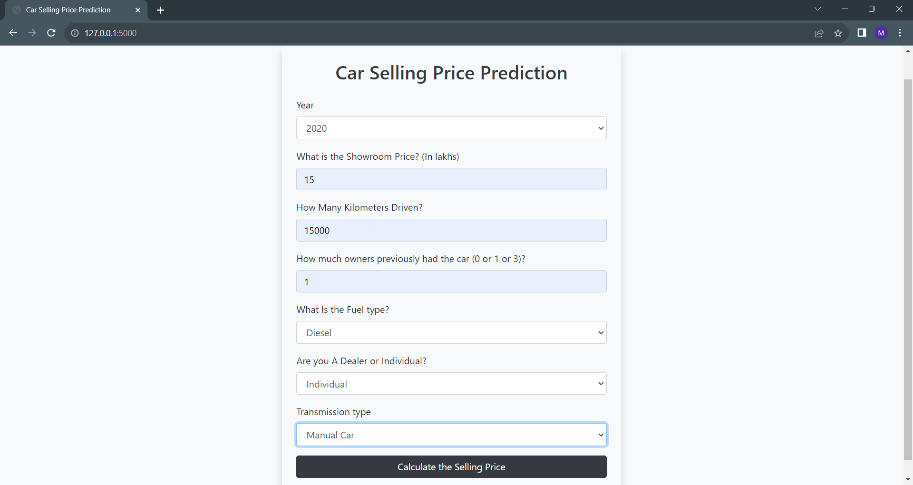
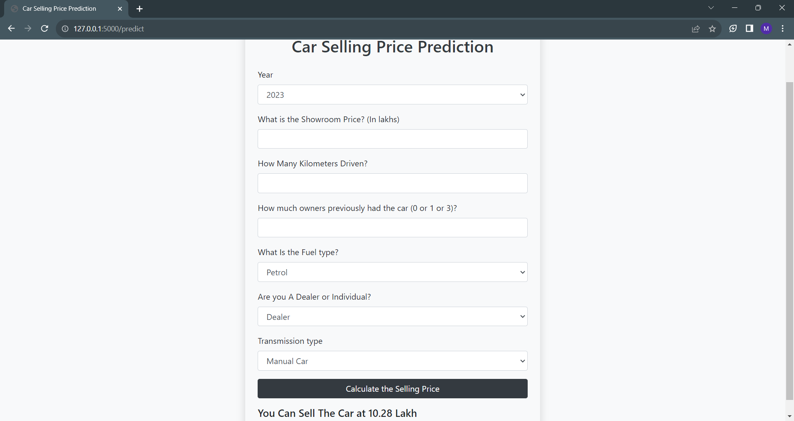

# Car Selling Price Prediction

This project implements a simple web application for predicting the selling price of used cars based on various features. The core of the application is a machine learning model trained on historical car data. Users can input information such as the year of manufacture, showroom price, kilometers driven, previous owners, fuel type, seller type, and transmission type to get an estimated selling price.


# Project Structure
* 'app.py': This is the main script that defines the Flask application. It loads a pre-trained machine learning model (random_forest_regression_model.pkl) and handles the routing for the web application.

* 'index.html': The HTML template for the web interface. It includes a form where users can input details about the car, and the predicted selling price is displayed on submission.


## Run Locally

To run the application locally, follow these steps:

1. Ensure you have Python installed on your machine.
2. Install the required dependencies by running the following command:

```bash
  pip install flask scikit-learn
```

3. Execute the app.py script:

```bash
  python app.py
```

4. Open a web browser and go to http://127.0.0.1:5000/.


## Features

- Year Selection: Users can choose the year of manufacture from a dropdown menu.
- Showroom Price: Input the showroom price of the car in lakhs.
- Kilometers Driven: Enter the number of kilometers the car has been driven.
- Previous Owners: Specify the number of previous owners (0, 1, or 3).
- Fuel Type: Select the fuel type (Petrol, Diesel, or CNG).
- Seller Type: Choose between being a Dealer or an Individual seller.
- Transmission Type: Specify the transmission type (Manual or Automatic).
- Prediction Display: After submitting the form, the predicted selling price or an appropriate message is displayed.


## Screenshots






## Important Notes
* The machine learning model (random_forest_regression_model.pkl) should be trained and saved beforehand using appropriate data.

* Ensure that the required dependencies are installed using the provided 'requirements.txt' file.

